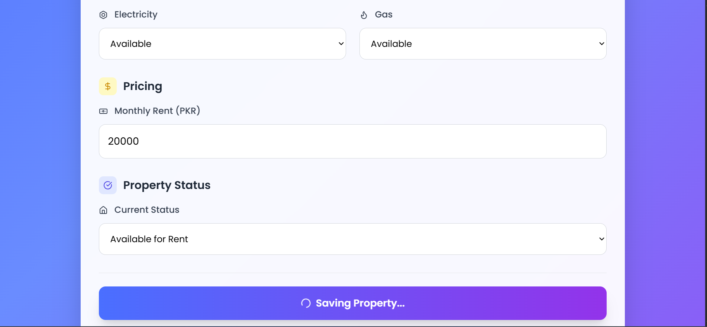
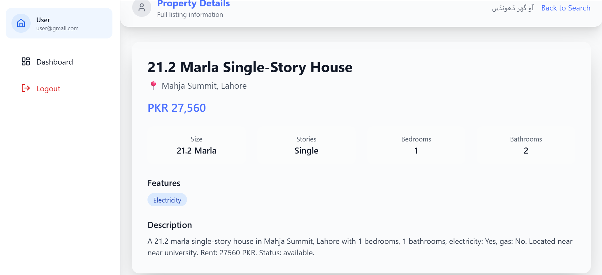

# Rental AI Agent

A Flask-based web application designed to facilitate rental property management using AI-driven recommendations. This application leverages the LangGraph agent to provide intelligent property search and recommendations based on user queries.

## Features

- **User Authentication**: Register and login functionality for users.
- **Property Management**: Upload, view, and manage property listings.
- **AI Recommendations**: LangGraph agent for providing rental recommendations based on user queries.
- **Property Status Updates**: Update the status of properties (available/rented).
- **Semantic Search**: Utilizes FAISS for efficient similarity search in property listings.

## Why We Made This

The Rental AI Agent was created to address the inefficiencies in the current rental property market. Traditional platforms often lack intelligent search capabilities, making it difficult for users to find properties that truly match their needs. Our platform uses advanced AI to understand user queries in natural language and provide recommendations that are contextually relevant, making property searches faster, more intuitive, and more accurate.

## How It's Different

Unlike existing platforms, the Rental AI Agent integrates cutting-edge AI technologies to interpret user queries and provide tailored property recommendations. The system uses LangGraph for natural language understanding and FAISS for efficient similarity searches, ensuring users find properties that closely match their preferences. This AI-driven approach sets us apart by offering a more personalized and efficient property search experience.

## Assets

Here are some screenshots of the application:

### AI Response

### Authentication Page

### Home Page

### Property Owner's Home Page

### How It Works

### List Property

### List Property Example

### Property Detail

### Sample Query

### User Search Page

### Why Choose House AI

## Tech Stack

- **Backend**: Python, Flask
- **AI/ML**: LangGraph, FAISS for similarity search, OpenAI's LLM for natural language processing
- **Data Handling**: Pandas for CSV data manipulation
- **Frontend**: HTML, CSS, JavaScript

## Disclaimer

Please note that all files and code provided in this repository are **for demonstration purposes only**. These are sample implementations intended to showcase the functionality and design of the Rental AI Agent. Complete source files, models, and datasets will be shared **only under collaboration, research partnerships, or authorized use**. Unauthorized redistribution or commercial use is not permitted.

## Contact

For collaboration, research inquiries, or further information, feel free to reach out via email:  
📧 [syedsaadi427@gmail.com](mailto:syedsaadi427@gmail.com)